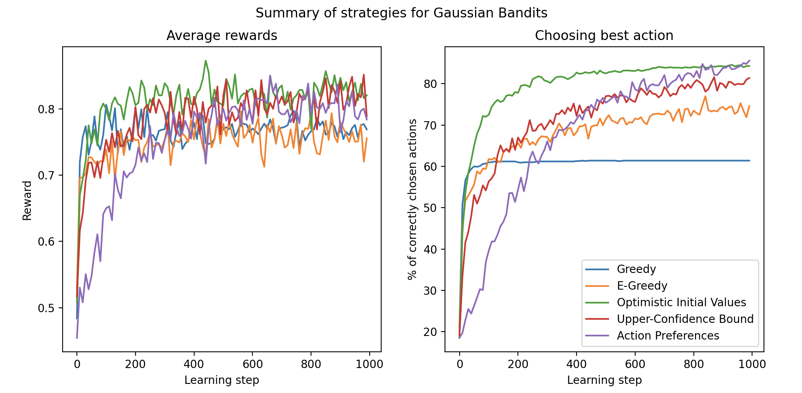
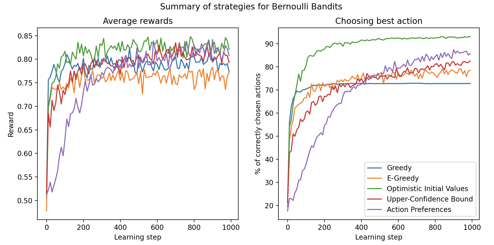

# Multi-armed bandit Reinforcement Learning

Multi-armed bandit problem is a problem in which an agent has to learn to choose which "arm" is the best. Each arm samples a reward from a specified distribution using randomly initialized parameters. More details can be found [here](https://en.wikipedia.org/wiki/Multi-armed_bandit).

## Learning strategies

1. Greedy
2. Epsilon-Greedy
3. Optimistic Initial Values
4. Upper-Confidence Bound
5. Action Preferences

## Experiment setup

The experimental setup is defined by a couple of variables:

1. k - number of arms
2. N - number of trials
3. T - number of learning steps

After the experiment is ran, you have the option to display the diagnostics and see the learning progress on a plot.

Furthermore, the agents is tested on two types of arms. First type samples the reward from normal distribution, second one from Bernoulli distribution.

## Usage

Just run:

```
python3 main.py
```

and input the required variables. The experiment will run according to specified settings and display the diagnostics.

If you want to change the hyperparameters, feel free to do so in `constants.py`.

## Results

Here are the results for each strategy, for both types of arms. For this experiment I used the parameters:

```
k: 5
N: 1000
T: 1000
```

and the default hyperparameters specified in `constants.py`.



